# システム設計書 — 2026 W杯 選手図鑑 Webアプリ

> バージョン: 0.1  
> 作成日: 2026-06-27  
> 対応ドキュメント: `requirements.md` / `tech-stack.md`

---

## 目次

1. [システム構成図](#1-システム構成図)
2. [データフロー](#2-データフロー)
3. [API 設計](#3-api-設計)
4. [ディレクトリ構成](#4-ディレクトリ構成)
5. [TypeScript 型設計](#5-typescript-型設計)
6. [ER 図（将来用）](#6-er-図将来用)
7. [コンポーネント設計](#7-コンポーネント設計)
8. [サービス設計](#8-サービス設計)
9. [状態管理設計](#9-状態管理設計)

---

## 1. システム構成図

### 1.1 全体アーキテクチャ

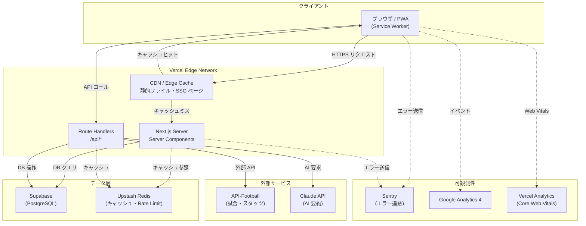

### 1.2 ページ別レンダリング戦略

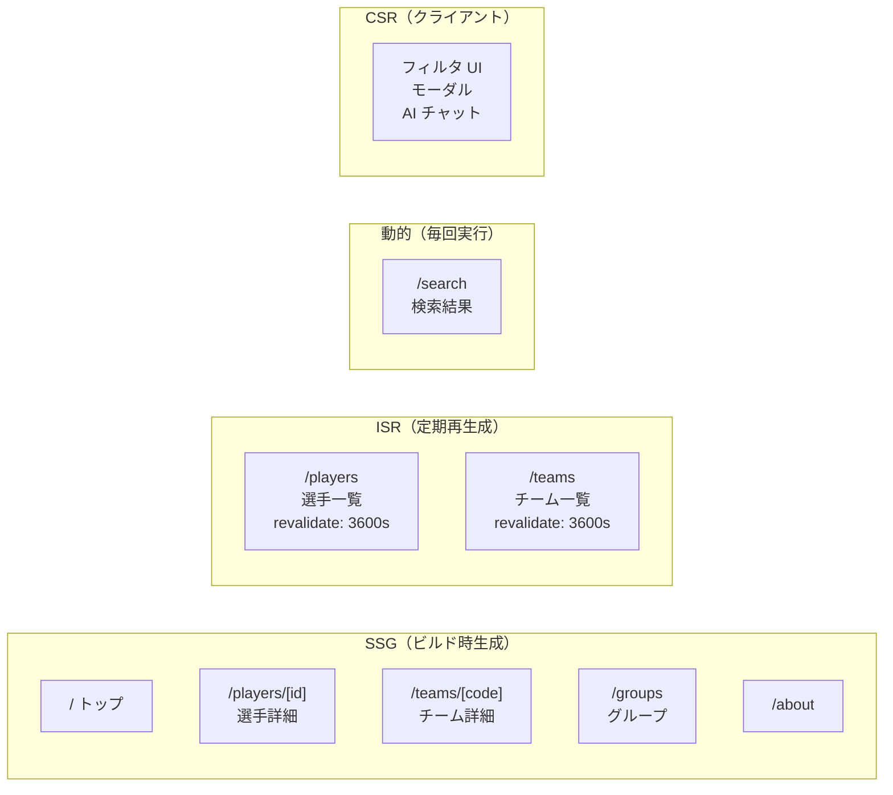

---

## 2. データフロー

### 2.1 初回ページ表示（SSG ページ）

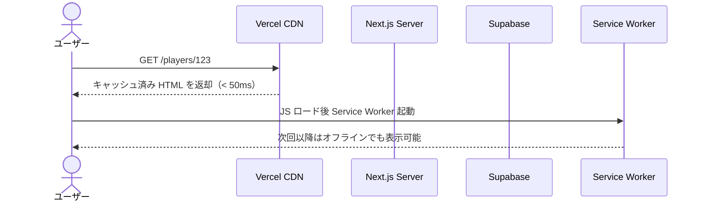

### 2.2 ISR によるデータ更新フロー

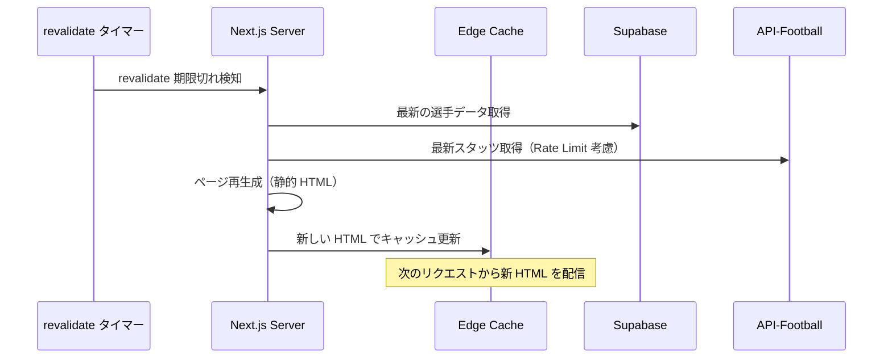

### 2.3 検索フロー

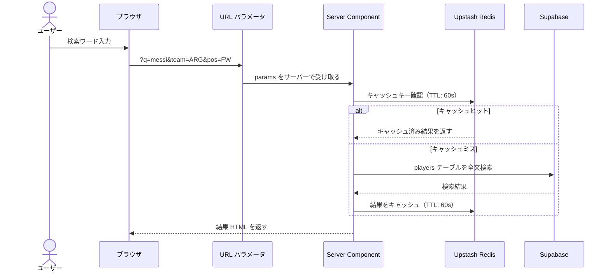

### 2.4 外部 API データ同期フロー（Phase 2）

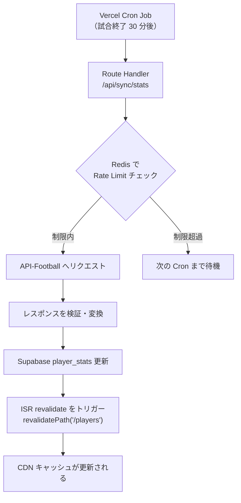

---

## 3. API 設計

### 3.1 エンドポイント一覧

すべて Next.js Route Handlers（`/app/api/`）で実装する。

| メソッド | パス | 説明 | キャッシュ |
|----------|------|------|------------|
| GET | `/api/players` | 選手一覧（フィルタ対応） | Redis 60s |
| GET | `/api/players/[id]` | 選手詳細 | ISR 3600s |
| GET | `/api/teams` | 代表チーム一覧 | ISR 3600s |
| GET | `/api/teams/[code]` | チーム詳細 + メンバー | ISR 3600s |
| GET | `/api/groups` | グループ一覧 + 勝点表 | ISR 1800s |
| GET | `/api/matches` | 試合日程・結果 | ISR 1800s |
| GET | `/api/search` | 全文検索 | Redis 60s |
| GET | `/api/stats/ranking` | スタッツランキング | ISR 3600s |
| POST | `/api/ai/summary` | AI による選手要約生成 | Redis 86400s |
| POST | `/api/sync/stats` | 外部 API からスタッツ同期（Cron 用） | なし |

### 3.2 リクエスト・レスポンス仕様

#### `GET /api/players`

```
クエリパラメータ:
  team    string?   ISO 3166-1 alpha-3 国コード（例: JPN, BRA）
  pos     string?   GK | DF | MF | FW
  q       string?   名前の部分一致
  page    number?   ページ番号（デフォルト: 1）
  limit   number?   1ページの件数（デフォルト: 20, 最大: 100）
  sort    string?   goals_desc | name_asc（デフォルト: name_asc）
```

```json
// 200 OK
{
  "data": [
    {
      "id": "uuid",
      "nameJa": "リオネル・メッシ",
      "nameEn": "Lionel Messi",
      "teamCode": "ARG",
      "teamNameJa": "アルゼンチン",
      "position": "FW",
      "jerseyNumber": 10,
      "imageUrl": "https://...",
      "stats": {
        "goals": 3,
        "assists": 2
      }
    }
  ],
  "meta": {
    "total": 736,
    "page": 1,
    "limit": 20,
    "totalPages": 37
  }
}
```

#### `GET /api/players/[id]`

```json
// 200 OK
{
  "data": {
    "id": "uuid",
    "nameJa": "リオネル・メッシ",
    "nameEn": "Lionel Messi",
    "age": 38,
    "height": 170,
    "weight": 72,
    "nationality": "アルゼンチン",
    "position": "FW",
    "jerseyNumber": 10,
    "clubName": "Inter Miami CF",
    "clubCountry": "USA",
    "imageUrl": "https://...",
    "team": {
      "code": "ARG",
      "nameJa": "アルゼンチン",
      "flagUrl": "https://..."
    },
    "stats": {
      "goals": 3,
      "assists": 2,
      "minutesPlayed": 540,
      "matchesPlayed": 6,
      "yellowCards": 1,
      "redCards": 0
    }
  }
}
```

#### `GET /api/search`

```
クエリパラメータ:
  q     string  検索ワード（必須、最小 1 文字）
  type  string? players | teams | all（デフォルト: all）
```

```json
// 200 OK
{
  "data": {
    "players": [
      { "id": "uuid", "nameJa": "...", "teamCode": "...", "position": "FW" }
    ],
    "teams": [
      { "code": "JPN", "nameJa": "日本", "flagUrl": "..." }
    ]
  },
  "query": "メッシ",
  "totalResults": 5
}
```

#### `POST /api/ai/summary`

```json
// リクエスト
{ "playerId": "uuid" }

// 200 OK（ストリーミングレスポンス）
// Content-Type: text/event-stream
data: {"text": "リオネル・メッシは"}
data: {"text": "アルゼンチン代表の"}
data: {"text": "エースストライカーで..."}
data: [DONE]
```

#### エラーレスポンス共通形式

```json
// 404 Not Found
{
  "error": {
    "code": "PLAYER_NOT_FOUND",
    "message": "指定された選手が見つかりません",
    "statusCode": 404
  }
}

// 429 Too Many Requests
{
  "error": {
    "code": "RATE_LIMIT_EXCEEDED",
    "message": "リクエスト数の上限に達しました。しばらくしてから再試行してください",
    "statusCode": 429,
    "retryAfter": 60
  }
}
```

---

## 4. ディレクトリ構成

```
2026-world-cup-player/
├── public/
│   ├── icons/                      # PWA アイコン
│   ├── flags/                      # 国旗 SVG（静的）
│   └── og-default.png              # デフォルト OGP 画像
│
├── src/
│   ├── app/                        # Next.js App Router
│   │   ├── layout.tsx              # ルートレイアウト（GA・Sentry 初期化）
│   │   ├── page.tsx                # トップページ
│   │   ├── not-found.tsx           # 404 ページ
│   │   ├── error.tsx               # グローバルエラーページ
│   │   │
│   │   ├── players/
│   │   │   ├── page.tsx            # 選手一覧（ISR）
│   │   │   ├── loading.tsx         # Skeleton UI
│   │   │   └── [id]/
│   │   │       ├── page.tsx        # 選手詳細（SSG）
│   │   │       └── opengraph-image.tsx  # 動的 OGP 画像生成
│   │   │
│   │   ├── teams/
│   │   │   ├── page.tsx            # チーム一覧（ISR）
│   │   │   └── [code]/
│   │   │       └── page.tsx        # チーム詳細（SSG）
│   │   │
│   │   ├── groups/
│   │   │   └── page.tsx            # グループステージ（ISR）
│   │   │
│   │   ├── search/
│   │   │   └── page.tsx            # 検索結果（Dynamic）
│   │   │
│   │   ├── about/
│   │   │   └── page.tsx            # About（静的）
│   │   │
│   │   └── api/
│   │       ├── players/
│   │       │   ├── route.ts        # GET /api/players
│   │       │   └── [id]/
│   │       │       └── route.ts    # GET /api/players/[id]
│   │       ├── teams/
│   │       │   ├── route.ts
│   │       │   └── [code]/
│   │       │       └── route.ts
│   │       ├── groups/
│   │       │   └── route.ts
│   │       ├── matches/
│   │       │   └── route.ts
│   │       ├── search/
│   │       │   └── route.ts
│   │       ├── stats/
│   │       │   └── ranking/
│   │       │       └── route.ts
│   │       ├── ai/
│   │       │   └── summary/
│   │       │       └── route.ts    # POST（ストリーミング）
│   │       └── sync/
│   │           └── stats/
│   │               └── route.ts    # Cron 用（Vercel Cron Jobs）
│   │
│   ├── components/
│   │   ├── ui/                     # shadcn/ui（自動生成・触らない）
│   │   │   ├── button.tsx
│   │   │   ├── card.tsx
│   │   │   ├── badge.tsx
│   │   │   ├── input.tsx
│   │   │   ├── select.tsx
│   │   │   ├── skeleton.tsx
│   │   │   └── table.tsx
│   │   │
│   │   ├── layout/                 # レイアウト系
│   │   │   ├── Header.tsx
│   │   │   ├── Footer.tsx
│   │   │   ├── MobileNav.tsx
│   │   │   └── Breadcrumb.tsx
│   │   │
│   │   ├── player/                 # 選手関連
│   │   │   ├── PlayerCard.tsx      # 一覧用カード
│   │   │   ├── PlayerCardSkeleton.tsx
│   │   │   ├── PlayerGrid.tsx      # カードのグリッドレイアウト
│   │   │   ├── PlayerProfile.tsx   # 詳細ページのプロフィール
│   │   │   ├── PlayerStats.tsx     # スタッツ表示
│   │   │   ├── PlayerFilter.tsx    # フィルタ UI（Client Component）
│   │   │   └── PlayerAISummary.tsx # AI 要約（Client Component）
│   │   │
│   │   ├── team/                   # チーム関連
│   │   │   ├── TeamCard.tsx
│   │   │   ├── TeamCardSkeleton.tsx
│   │   │   ├── TeamGrid.tsx
│   │   │   └── TeamMemberList.tsx
│   │   │
│   │   ├── group/                  # グループ関連
│   │   │   ├── GroupStandingsTable.tsx
│   │   │   └── GroupSelector.tsx
│   │   │
│   │   ├── search/
│   │   │   ├── SearchBar.tsx       # 検索入力（Client Component）
│   │   │   └── SearchResults.tsx
│   │   │
│   │   └── common/
│   │       ├── PositionBadge.tsx   # FW/MF/DF/GK バッジ
│   │       ├── FlagImage.tsx       # 国旗画像（Next Image wrapper）
│   │       ├── PlayerImage.tsx     # 選手画像（フォールバック付き）
│   │       ├── JsonLd.tsx          # 構造化データ
│   │       └── CookieConsent.tsx   # Cookie 同意バナー（AdSense 用）
│   │
│   ├── lib/
│   │   ├── supabase/
│   │   │   ├── client.ts           # ブラウザ用クライアント
│   │   │   ├── server.ts           # サーバー用クライアント（Server Components）
│   │   │   └── types.ts            # supabase gen types の出力先
│   │   │
│   │   ├── redis/
│   │   │   └── client.ts           # Upstash Redis クライアント
│   │   │
│   │   ├── ai/
│   │   │   └── client.ts           # Claude API クライアント（Vercel AI SDK）
│   │   │
│   │   └── utils/
│   │       ├── cn.ts               # clsx + tailwind-merge
│   │       ├── format.ts           # 日付・数値フォーマット
│   │       └── seo.ts              # メタタグ・構造化データ生成
│   │
│   ├── services/                   # ビジネスロジック層
│   │   ├── playerService.ts
│   │   ├── teamService.ts
│   │   ├── groupService.ts
│   │   ├── matchService.ts
│   │   ├── statsService.ts
│   │   ├── searchService.ts
│   │   ├── aiService.ts
│   │   └── syncService.ts          # 外部 API 同期
│   │
│   ├── stores/                     # Zustand ストア
│   │   ├── filterStore.ts
│   │   └── uiStore.ts
│   │
│   ├── hooks/                      # カスタムフック
│   │   ├── usePlayerFilter.ts
│   │   ├── useSearch.ts
│   │   └── useAISummary.ts
│   │
│   ├── types/                      # アプリケーション型定義
│   │   ├── player.ts
│   │   ├── team.ts
│   │   ├── match.ts
│   │   ├── stats.ts
│   │   └── api.ts                  # API レスポンス型
│   │
│   └── constants/
│       ├── positions.ts            # ポジション定数
│       ├── groups.ts               # グループ定数
│       └── routes.ts               # パス定数
│
├── sentry.client.config.ts
├── sentry.server.config.ts
├── sentry.edge.config.ts
├── next.config.ts
├── tailwind.config.ts
├── tsconfig.json
└── package.json
```

---

## 5. TypeScript 型設計

### 5.1 ドメイン型

```typescript
// types/player.ts

export type Position = 'GK' | 'DF' | 'MF' | 'FW'

export type GroupName = 'A' | 'B' | 'C' | 'D' | 'E' | 'F' |
                        'G' | 'H' | 'I' | 'J' | 'K' | 'L'

export type MatchStage =
  | 'GROUP'
  | 'ROUND_OF_32'
  | 'ROUND_OF_16'
  | 'QUARTER_FINAL'
  | 'SEMI_FINAL'
  | 'THIRD_PLACE'
  | 'FINAL'

// ------ 選手 ------

export interface Player {
  id: string
  nameJa: string
  nameEn: string
  age: number
  height: number | null  // cm
  weight: number | null  // kg
  nationality: string
  position: Position
  jerseyNumber: number
  clubName: string
  clubCountry: string
  imageUrl: string | null
  teamCode: string
  createdAt: string
  updatedAt: string
}

export interface PlayerWithTeam extends Player {
  team: Pick<Team, 'code' | 'nameJa' | 'nameEn' | 'flagUrl'>
}

export interface PlayerWithStats extends PlayerWithTeam {
  stats: TournamentStats
}

// 一覧表示用（軽量型）
export type PlayerSummary = Pick<
  PlayerWithTeam,
  'id' | 'nameJa' | 'nameEn' | 'position' | 'jerseyNumber' | 'imageUrl' | 'teamCode' | 'team'
> & {
  stats: Pick<TournamentStats, 'goals' | 'assists'>
}

// ------ チーム ------

export interface Team {
  code: string           // ISO 3166-1 alpha-3（例: JPN）
  nameJa: string
  nameEn: string
  groupName: GroupName
  coachName: string | null
  flagUrl: string
  createdAt: string
}

export interface TeamWithPlayers extends Team {
  players: PlayerSummary[]
  standing: GroupStanding
}

// ------ グループ ------

export interface Group {
  name: GroupName
  teams: TeamWithStanding[]
}

export interface TeamWithStanding extends Team {
  standing: GroupStanding
}

export interface GroupStanding {
  teamCode: string
  played: number
  won: number
  drawn: number
  lost: number
  goalsFor: number
  goalsAgainst: number
  goalDifference: number
  points: number
}

// ------ 試合 ------

export interface Match {
  id: string
  homeTeamCode: string
  awayTeamCode: string
  homeScore: number | null
  awayScore: number | null
  matchDate: string      // ISO 8601
  stage: MatchStage
  groupName: GroupName | null
  venue: string
  city: string
}

export interface MatchWithTeams extends Match {
  homeTeam: Pick<Team, 'code' | 'nameJa' | 'flagUrl'>
  awayTeam: Pick<Team, 'code' | 'nameJa' | 'flagUrl'>
}

// ------ スタッツ ------

export interface PlayerMatchStats {
  playerId: string
  matchId: string
  goals: number
  assists: number
  yellowCards: number
  redCards: number
  minutesPlayed: number
}

export interface TournamentStats {
  playerId: string
  goals: number
  assists: number
  yellowCards: number
  redCards: number
  minutesPlayed: number
  matchesPlayed: number
}

export interface StatsRanking {
  category: 'goals' | 'assists' | 'minutes'
  players: Array<PlayerSummary & { value: number; rank: number }>
}
```

### 5.2 API 型

```typescript
// types/api.ts

// 共通レスポンスラッパー
export interface ApiResponse<T> {
  data: T
}

export interface PaginatedApiResponse<T> extends ApiResponse<T[]> {
  meta: {
    total: number
    page: number
    limit: number
    totalPages: number
  }
}

export interface ApiError {
  error: {
    code: string
    message: string
    statusCode: number
    retryAfter?: number
  }
}

// エンドポイント別クエリパラメータ
export interface PlayersQuery {
  team?: string
  pos?: Position
  q?: string
  page?: number
  limit?: number
  sort?: 'goals_desc' | 'assists_desc' | 'name_asc'
}

export interface SearchQuery {
  q: string
  type?: 'players' | 'teams' | 'all'
}

export interface SearchResponse {
  data: {
    players: PlayerSummary[]
    teams: Array<Pick<Team, 'code' | 'nameJa' | 'nameEn' | 'flagUrl'>>
  }
  query: string
  totalResults: number
}
```

### 5.3 ストア型

```typescript
// stores/filterStore.ts

export interface FilterState {
  teamCode: string | null
  position: Position | null
  sortBy: 'goals_desc' | 'assists_desc' | 'name_asc'
  setTeamCode: (code: string | null) => void
  setPosition: (pos: Position | null) => void
  setSortBy: (sort: FilterState['sortBy']) => void
  reset: () => void
}

// stores/uiStore.ts

export interface UIState {
  isMobileNavOpen: boolean
  isFilterPanelOpen: boolean
  toggleMobileNav: () => void
  toggleFilterPanel: () => void
  closeAll: () => void
}
```

---

## 6. ER 図（将来用）

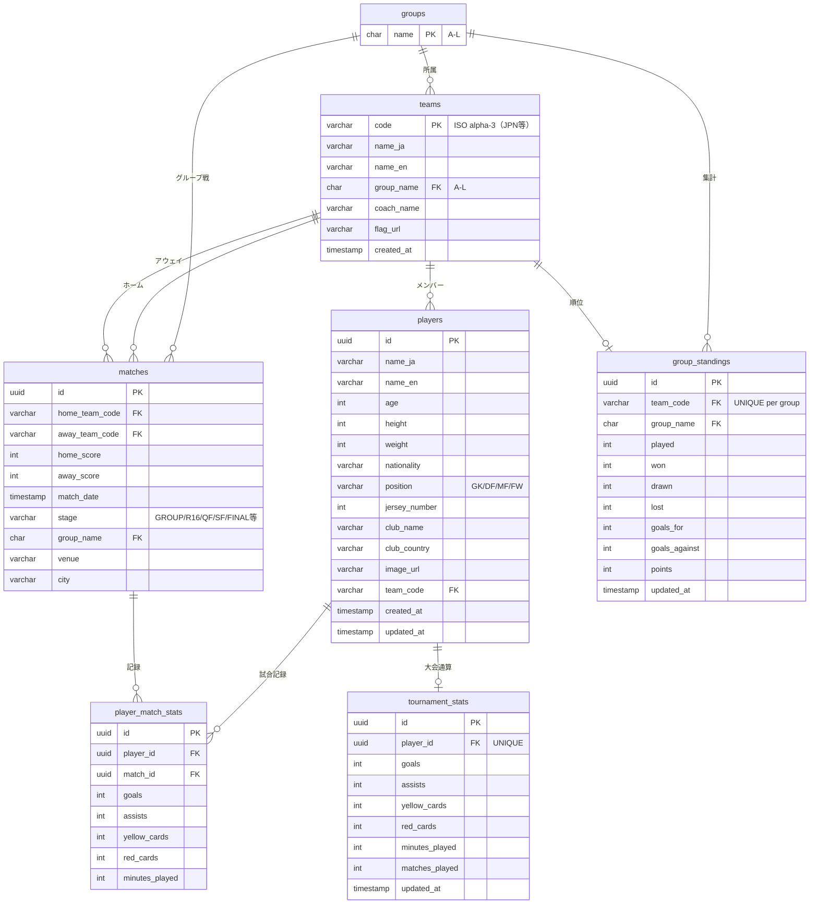

### インデックス設計（主なもの）

```sql
-- 検索性能
CREATE INDEX idx_players_name_ja ON players USING gin(to_tsvector('simple', name_ja));
CREATE INDEX idx_players_name_en ON players USING gin(to_tsvector('simple', name_en));
CREATE INDEX idx_players_team_code ON players(team_code);
CREATE INDEX idx_players_position ON players(position);

-- 試合スケジュール
CREATE INDEX idx_matches_date ON matches(match_date);
CREATE INDEX idx_matches_stage ON matches(stage);

-- スタッツ順位
CREATE INDEX idx_tournament_stats_goals ON tournament_stats(goals DESC);
CREATE INDEX idx_tournament_stats_assists ON tournament_stats(assists DESC);
```

---

## 7. コンポーネント設計

### 7.1 コンポーネント階層

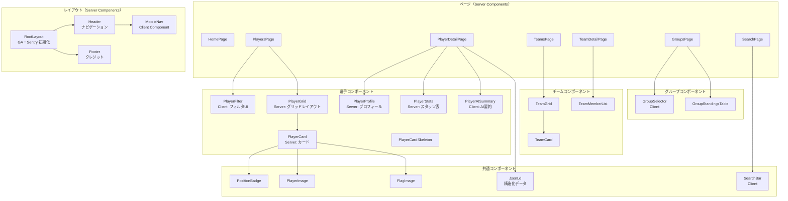

### 7.2 主要コンポーネントの Props 定義

```typescript
// PlayerCard
interface PlayerCardProps {
  player: PlayerSummary
  priority?: boolean  // LCP 対象画像かどうか（Next Image 用）
}

// PlayerFilter（Client Component）
interface PlayerFilterProps {
  teams: Array<Pick<Team, 'code' | 'nameJa'>>
  initialTeam?: string
  initialPosition?: Position
}

// GroupStandingsTable
interface GroupStandingsTableProps {
  group: Group
  highlightTeamCode?: string  // 注目チームをハイライト
}

// PositionBadge
interface PositionBadgeProps {
  position: Position
  size?: 'sm' | 'md'
}

// PlayerImage
interface PlayerImageProps {
  src: string | null
  name: string           // alt テキスト用
  size?: number          // px（デフォルト: 80）
  priority?: boolean
}
```

---

## 8. サービス設計

### 8.1 サービス層の役割

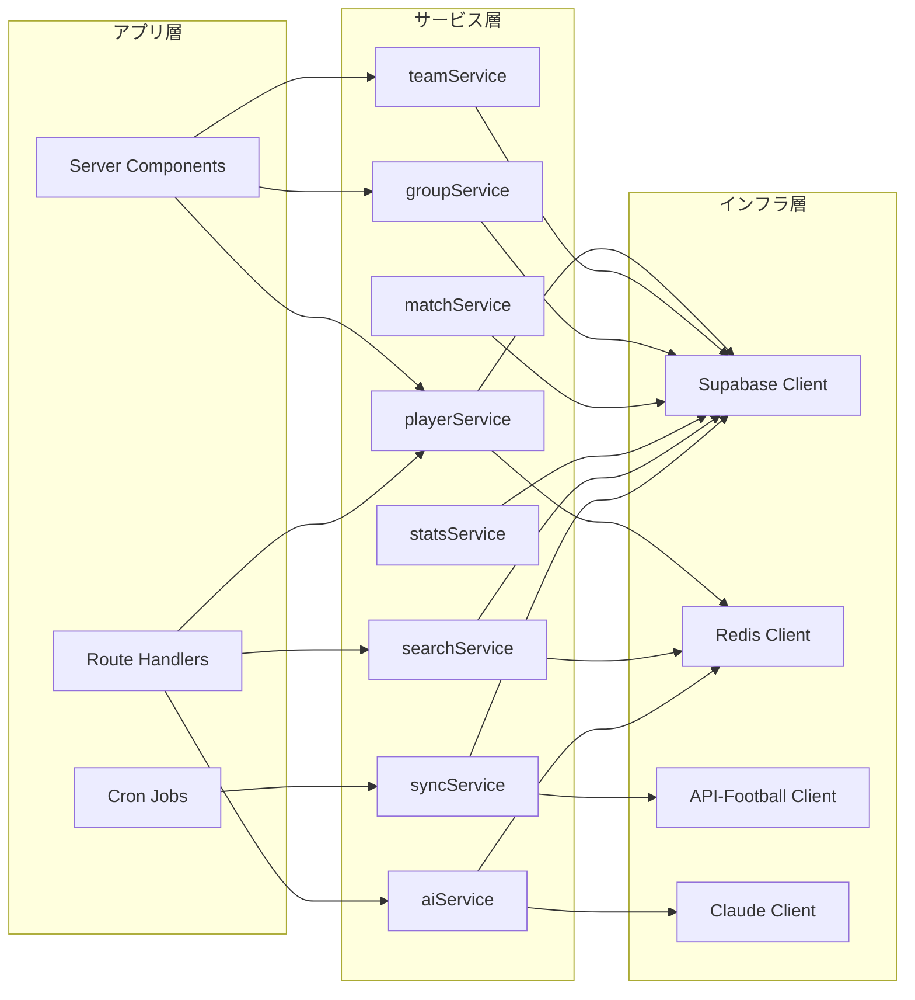

### 8.2 各サービスの公開インターフェース

```typescript
// services/playerService.ts
interface PlayerService {
  getPlayers(query: PlayersQuery): Promise<PaginatedApiResponse<PlayerSummary>>
  getPlayerById(id: string): Promise<PlayerWithStats | null>
  getPlayersByTeam(teamCode: string): Promise<PlayerSummary[]>
}

// services/teamService.ts
interface TeamService {
  getTeams(): Promise<Team[]>
  getTeamByCode(code: string): Promise<TeamWithPlayers | null>
}

// services/groupService.ts
interface GroupService {
  getAllGroups(): Promise<Group[]>
  getGroupByName(name: GroupName): Promise<Group | null>
}

// services/matchService.ts
interface MatchService {
  getMatches(stage?: MatchStage): Promise<MatchWithTeams[]>
  getUpcomingMatches(limit?: number): Promise<MatchWithTeams[]>
}

// services/statsService.ts
interface StatsService {
  getRanking(category: 'goals' | 'assists', limit?: number): Promise<StatsRanking>
  getPlayerStats(playerId: string): Promise<TournamentStats | null>
}

// services/searchService.ts
interface SearchService {
  search(query: SearchQuery): Promise<SearchResponse>
}

// services/aiService.ts
interface AIService {
  generatePlayerSummary(playerId: string): Promise<ReadableStream>
}

// services/syncService.ts
interface SyncService {
  syncMatchStats(matchId: string): Promise<{ updated: number; errors: string[] }>
  syncGroupStandings(): Promise<void>
}
```

### 8.3 キャッシュ戦略の実装パターン

```typescript
// サービス内でのキャッシュ利用パターン（例: searchService）

async function search(query: SearchQuery): Promise<SearchResponse> {
  const cacheKey = `search:${query.q}:${query.type ?? 'all'}`

  // 1. Redis キャッシュを確認
  const cached = await redis.get<SearchResponse>(cacheKey)
  if (cached) return cached

  // 2. DB から取得
  const [players, teams] = await Promise.all([
    query.type !== 'teams' ? searchPlayers(query.q) : [],
    query.type !== 'players' ? searchTeams(query.q) : [],
  ])

  const result: SearchResponse = {
    data: { players, teams },
    query: query.q,
    totalResults: players.length + teams.length,
  }

  // 3. Redis にキャッシュ（60秒）
  await redis.set(cacheKey, result, { ex: 60 })

  return result
}
```

---

## 9. 状態管理設計

### 9.1 状態の分類

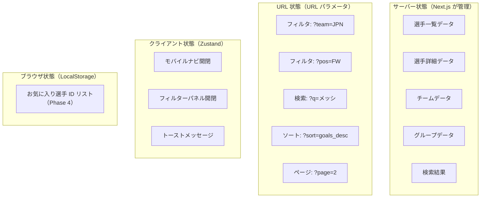

### 9.2 URL パラメータ設計

```
/players?team=JPN&pos=FW&sort=goals_desc&page=1

パラメータ一覧:
  team    国コード（3文字 ISO: JPN, BRA, ARG ...）
  pos     ポジション（GK | DF | MF | FW）
  sort    ソート順（goals_desc | assists_desc | name_asc）
  page    ページ番号（1始まり）
  q       検索ワード（検索結果ページ専用）
```

### 9.3 Zustand ストア実装

```typescript
// stores/filterStore.ts
import { create } from 'zustand'
import { Position } from '@/types/player'

interface FilterState {
  teamCode: string | null
  position: Position | null
  sortBy: 'goals_desc' | 'assists_desc' | 'name_asc'
  setTeamCode: (code: string | null) => void
  setPosition: (pos: Position | null) => void
  setSortBy: (sort: FilterState['sortBy']) => void
  reset: () => void
}

export const useFilterStore = create<FilterState>((set) => ({
  teamCode: null,
  position: null,
  sortBy: 'name_asc',
  setTeamCode: (code) => set({ teamCode: code }),
  setPosition: (pos) => set({ position: pos }),
  setSortBy: (sort) => set({ sortBy: sort }),
  reset: () => set({ teamCode: null, position: null, sortBy: 'name_asc' }),
}))

// stores/uiStore.ts
interface UIState {
  isMobileNavOpen: boolean
  isFilterPanelOpen: boolean
  toggleMobileNav: () => void
  toggleFilterPanel: () => void
  closeAll: () => void
}

export const useUIStore = create<UIState>((set) => ({
  isMobileNavOpen: false,
  isFilterPanelOpen: false,
  toggleMobileNav: () =>
    set((s) => ({ isMobileNavOpen: !s.isMobileNavOpen, isFilterPanelOpen: false })),
  toggleFilterPanel: () =>
    set((s) => ({ isFilterPanelOpen: !s.isFilterPanelOpen })),
  closeAll: () =>
    set({ isMobileNavOpen: false, isFilterPanelOpen: false }),
}))
```

### 9.4 フィルタと URL パラメータの同期パターン

```typescript
// hooks/usePlayerFilter.ts
// フィルタ UI の変更 → URL を更新 → Server Component が再取得 という流れ

'use client'
import { useRouter, useSearchParams } from 'next/navigation'
import { useCallback } from 'react'
import { Position } from '@/types/player'

export function usePlayerFilter() {
  const router = useRouter()
  const searchParams = useSearchParams()

  const updateFilter = useCallback(
    (key: string, value: string | null) => {
      const params = new URLSearchParams(searchParams.toString())
      if (value === null) {
        params.delete(key)
      } else {
        params.set(key, value)
      }
      params.delete('page') // フィルタ変更時は 1 ページ目に戻す
      router.push(`/players?${params.toString()}`, { scroll: false })
    },
    [router, searchParams],
  )

  return {
    teamCode: searchParams.get('team'),
    position: searchParams.get('pos') as Position | null,
    sortBy: searchParams.get('sort') ?? 'name_asc',
    setTeamCode: (code: string | null) => updateFilter('team', code),
    setPosition: (pos: Position | null) => updateFilter('pos', pos),
    setSortBy: (sort: string) => updateFilter('sort', sort),
  }
}
```

### 9.5 状態フロー図（フィルタ操作）

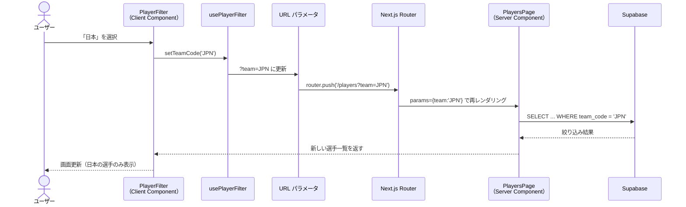

---

## 設計の整合性チェックリスト

```
[ ] 選手詳細ページ URL（/players/[id]）は `generateStaticParams` で全件 SSG できるか
[ ] 外部 API のレート制限内で ISR の revalidate 頻度を設定できるか
[ ] Supabase の無料枠（500MB）で全選手・スタッツデータが収まるか
[ ] Route Handlers に API キーが漏れていないか（環境変数の prefix チェック）
[ ] 検索クエリに SQL インジェクションの余地がないか（Supabase クライアントは自動エスケープ）
[ ] OGP 画像生成（opengraph-image.tsx）が選手詳細ページに設置されているか
```

---

*このドキュメントは `requirements.md`・`tech-stack.md` と合わせて参照してください。*  
*実装着手前にスキーマ・API 仕様を最終確認すること。*
