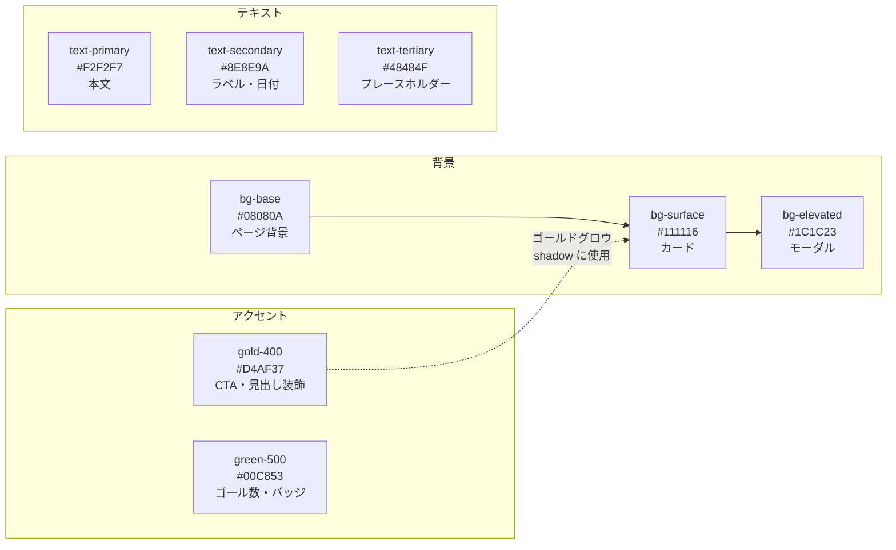
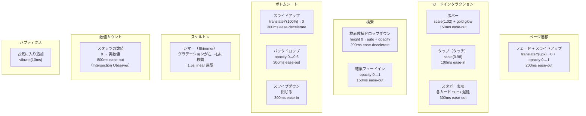
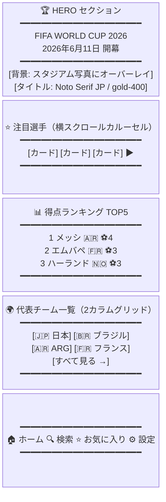
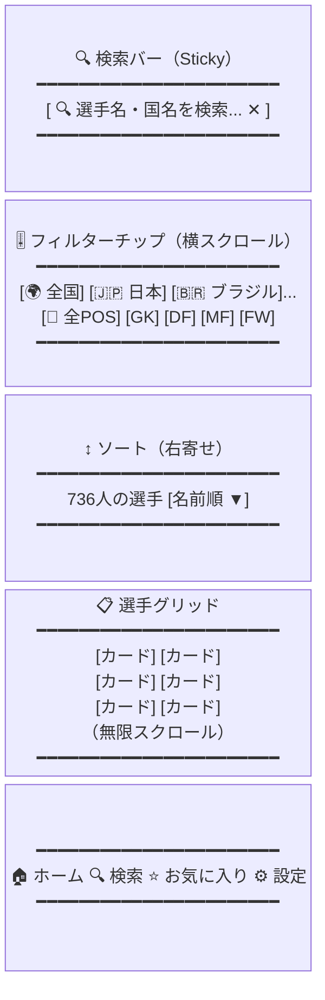
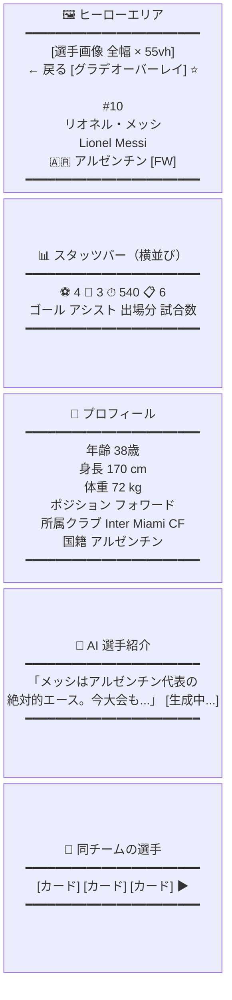
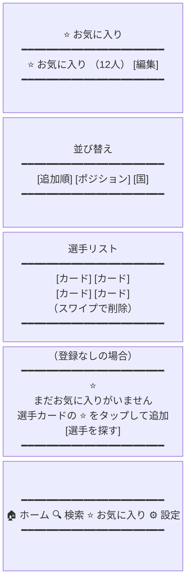
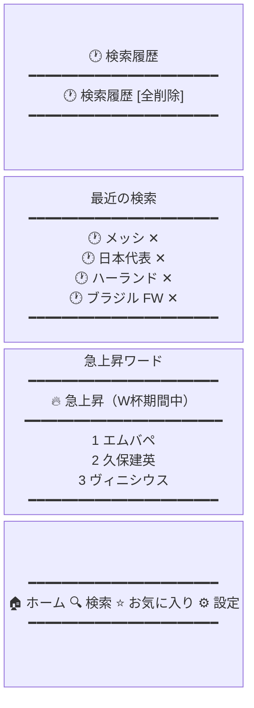
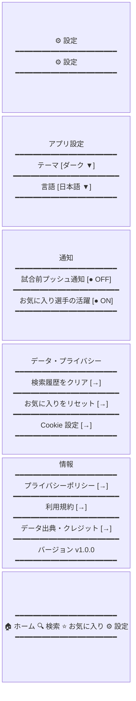
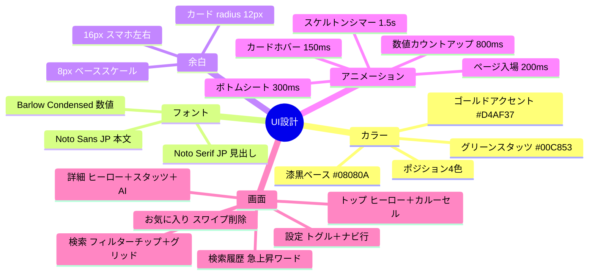

# UI デザイン設計書 — 2026 W杯 選手図鑑

> バージョン: 0.1  
> 作成日: 2026-06-27  
> テーマ: シンプル・高級感・サッカー・ダーク・スマホファースト

---

## 目次

1. [デザイントークン](#1-デザイントークン)
2. [タイポグラフィ](#2-タイポグラフィ)
3. [余白・グリッド](#3-余白グリッド)
4. [アニメーション](#4-アニメーション)
5. [共通コンポーネント](#5-共通コンポーネント)
6. [トップ画面](#6-トップ画面)
7. [検索画面](#7-検索画面)
8. [詳細画面](#8-詳細画面)
9. [お気に入り画面](#9-お気に入り画面)
10. [検索履歴画面](#10-検索履歴画面)
11. [設定画面](#11-設定画面)

---

## 1. デザイントークン

### 1.1 カラーパレット

```
コンセプト：
  夜のスタジアム＝ 漆黒のベース
  金のトロフィー＝ ゴールドアクセント
  芝のライン＝    サブアクセントにグリーン
```

```css
/* === ベースカラー（背景層） === */
--color-bg-base:      #08080A;  /* 最深部。スタジアムの夜 */
--color-bg-surface:   #111116;  /* カード・コンテナの背景 */
--color-bg-elevated:  #1C1C23;  /* モーダル・ドロワーの背景 */
--color-bg-overlay:   #252530;  /* ホバー・アクティブ状態 */

/* === ボーダー === */
--color-border-subtle: #1E1E28;  /* 区切り線（ほぼ見えない） */
--color-border-default:#2E2E3E;  /* カード輪郭 */
--color-border-strong: #3E3E52;  /* 強調ボーダー */

/* === アクセント：ゴールド（高級感・トロフィー） === */
--color-gold-50:  #FDF8E1;
--color-gold-300: #F0D060;
--color-gold-400: #D4AF37;  /* メインアクセント */
--color-gold-500: #B8960C;
--color-gold-600: #8A6F00;

/* === アクセント：グリーン（ピッチ・数値） === */
--color-green-400: #00E676;
--color-green-500: #00C853;  /* スタッツ・バッジ */
--color-green-600: #009624;

/* === テキスト === */
--color-text-primary:   #F2F2F7;  /* メインテキスト */
--color-text-secondary: #8E8E9A;  /* サブテキスト */
--color-text-tertiary:  #48484F;  /* 補足・プレースホルダー */
--color-text-inverse:   #08080A;  /* 金ボタン上のテキスト */

/* === ポジションカラー === */
--color-pos-gk: #F59E0B;  /* アンバー */
--color-pos-df: #3B82F6;  /* ブルー */
--color-pos-mf: #10B981;  /* エメラルド */
--color-pos-fw: #EF4444;  /* レッド */

/* === セマンティック === */
--color-error:   #FF453A;
--color-warning: #FF9F0A;
--color-success: #30D158;
--color-info:    #0A84FF;
```

### 1.2 カラー使用ルール



---

## 2. タイポグラフィ

### 2.1 フォント定義

```css
/* Google Fonts で読み込む */
@import url('https://fonts.googleapis.com/css2?family=Noto+Sans+JP:wght@400;500;700&family=Noto+Serif+JP:wght@700&family=Barlow+Condensed:wght@400;600;700&display=swap');

:root {
  /* 見出し用（日本語） */
  --font-heading-ja: 'Noto Serif JP', serif;

  /* 本文（日本語） */
  --font-body-ja: 'Noto Sans JP', sans-serif;

  /* 数字・ラテン文字（スタッツ・背番号） */
  --font-numeric: 'Barlow Condensed', sans-serif;
}
```

**フォント選定理由**

| フォント | 役割 | 理由 |
|----------|------|------|
| Noto Serif JP | 大見出し・選手名 | セリフ体が高級感を演出。漢字も美しく表示 |
| Noto Sans JP | 本文・UI ラベル | 可読性最高。Google の標準日本語フォント |
| Barlow Condensed | 数字・英字スタッツ | 縦長で数値が際立ち、スポーツ媒体らしさが出る |

### 2.2 タイプスケール

```css
/* --- ディスプレイ（ヒーロー・選手名） --- */
--text-display-xl: clamp(2.5rem, 8vw, 4rem);    /* 40-64px */
--text-display-lg: clamp(2rem, 6vw, 3rem);       /* 32-48px */

/* --- 見出し --- */
--text-h1: clamp(1.5rem, 4vw, 2rem);    /* 24-32px */
--text-h2: clamp(1.25rem, 3vw, 1.5rem); /* 20-24px */
--text-h3: 1.125rem;                     /* 18px */

/* --- 本文 --- */
--text-body-lg: 1rem;      /* 16px */
--text-body:    0.875rem;  /* 14px */
--text-body-sm: 0.8125rem; /* 13px */

/* --- UI --- */
--text-label:   0.75rem;   /* 12px（バッジ・キャプション） */
--text-micro:   0.6875rem; /* 11px（最小） */

/* --- 数値（Barlow Condensed） --- */
--text-stat-xl: clamp(3rem, 10vw, 5rem);  /* ゴール数大表示 */
--text-stat-lg: 2rem;
--text-stat:    1.5rem;

/* --- ウェイト --- */
--font-normal:   400;
--font-medium:   500;
--font-semibold: 600;
--font-bold:     700;

/* --- 行間 --- */
--leading-tight:  1.2;
--leading-normal: 1.5;
--leading-loose:  1.8;  /* 日本語本文 */

/* --- 字間 --- */
--tracking-tight:  -0.02em;  /* 大見出し */
--tracking-normal:  0em;
--tracking-wide:    0.05em;  /* ラベル・キャプション */
--tracking-widest:  0.1em;   /* ポジションバッジ */
```

---

## 3. 余白・グリッド

### 3.1 スペーシングスケール（8px ベース）

```css
:root {
  --space-1:  0.25rem;  /*  4px */
  --space-2:  0.5rem;   /*  8px */
  --space-3:  0.75rem;  /* 12px */
  --space-4:  1rem;     /* 16px */
  --space-5:  1.25rem;  /* 20px */
  --space-6:  1.5rem;   /* 24px */
  --space-8:  2rem;     /* 32px */
  --space-10: 2.5rem;   /* 40px */
  --space-12: 3rem;     /* 48px */
  --space-16: 4rem;     /* 64px */
  --space-20: 5rem;     /* 80px */
  --space-24: 6rem;     /* 96px */
}
```

### 3.2 レイアウトグリッド

```
スマートフォン（< 640px）
┌──────────────────────────┐
│  16px  コンテンツ  16px  │
│        100% - 32px       │
└──────────────────────────┘

タブレット（640px〜）
┌────────────────────────────────┐
│  24px    コンテンツ    24px    │
│  2カラムグリッド（gap: 16px）  │
└────────────────────────────────┘

デスクトップ（1024px〜）
┌──────────────────────────────────────┐
│  auto  max-w: 1280px  auto           │
│  3〜4カラムグリッド（gap: 24px）     │
└──────────────────────────────────────┘
```

### 3.3 ボーダーラジウス

```css
--radius-sm:   4px;    /* バッジ・インプット */
--radius-md:   8px;    /* カード・ボタン */
--radius-lg:   16px;   /* モーダル・ボトムシート */
--radius-xl:   24px;   /* ヒーローカード */
--radius-full: 9999px; /* ピル・アバター */
```

### 3.4 シャドウ（グロウ効果）

```css
/* カード標準 */
--shadow-sm: 0 1px 3px rgba(0,0,0,0.5), 0 1px 2px rgba(0,0,0,0.6);

/* ゴールドグロウ（ホバー・フォーカス） */
--shadow-gold:
  0 0 0 1px rgba(212, 175, 55, 0.3),
  0 0 20px rgba(212, 175, 55, 0.12),
  0 4px 16px rgba(0, 0, 0, 0.4);

/* グリーングロウ（スタッツ強調） */
--shadow-green:
  0 0 0 1px rgba(0, 200, 83, 0.3),
  0 0 16px rgba(0, 200, 83, 0.10);

/* モーダル */
--shadow-overlay:
  0 24px 48px rgba(0, 0, 0, 0.7),
  0 8px 24px rgba(0, 0, 0, 0.5);
```

---

## 4. アニメーション

### 4.1 デュレーション・イージング

```css
/* === デュレーション === */
--duration-instant:  50ms;
--duration-fast:    100ms;
--duration-normal:  200ms;
--duration-slow:    300ms;
--duration-xslow:   500ms;

/* === イージング === */
--ease-out:        cubic-bezier(0.0, 0.0, 0.2, 1.0);  /* 入ってくる */
--ease-in:         cubic-bezier(0.4, 0.0, 1.0, 1.0);  /* 出ていく */
--ease-in-out:     cubic-bezier(0.4, 0.0, 0.2, 1.0);  /* 変化 */
--ease-spring:     cubic-bezier(0.34, 1.56, 0.64, 1); /* バウンド */
--ease-decelerate: cubic-bezier(0.0, 0.0, 0.2, 1.0);  /* ボトムシート */
```

### 4.2 アニメーション一覧



### 4.3 CSS アニメーション定義

```css
/* ページ入場 */
@keyframes page-enter {
  from { opacity: 0; transform: translateY(8px); }
  to   { opacity: 1; transform: translateY(0); }
}

/* カードスタガー */
@keyframes card-stagger {
  from { opacity: 0; transform: translateY(16px) scale(0.96); }
  to   { opacity: 1; transform: translateY(0) scale(1); }
}

/* シマースケルトン */
@keyframes shimmer {
  0%   { background-position: -200% center; }
  100% { background-position: 200% center; }
}
.skeleton {
  background: linear-gradient(
    90deg,
    var(--color-bg-surface) 25%,
    var(--color-bg-elevated) 50%,
    var(--color-bg-surface) 75%
  );
  background-size: 200% 100%;
  animation: shimmer 1.5s linear infinite;
}

/* ゴールドパルス（お気に入り追加） */
@keyframes gold-pulse {
  0%   { box-shadow: 0 0 0 0 rgba(212, 175, 55, 0.4); }
  70%  { box-shadow: 0 0 0 12px rgba(212, 175, 55, 0); }
  100% { box-shadow: 0 0 0 0 rgba(212, 175, 55, 0); }
}

/* ボトムシート */
@keyframes slide-up {
  from { transform: translateY(100%); }
  to   { transform: translateY(0); }
}

/* ハートアニメーション（お気に入り） */
@keyframes heart-pop {
  0%   { transform: scale(1); }
  40%  { transform: scale(1.3); }
  60%  { transform: scale(0.9); }
  100% { transform: scale(1); }
}
```

---

## 5. 共通コンポーネント

### 5.1 PositionBadge

```
GK  →  背景: #F59E0B  文字: #000
DF  →  背景: #3B82F6  文字: #FFF
MF  →  背景: #10B981  文字: #000
FW  →  背景: #EF4444  文字: #FFF

スタイル:
  font: Barlow Condensed 700 11px
  letter-spacing: 0.1em
  padding: 2px 8px
  border-radius: 4px
  text-transform: uppercase
```

### 5.2 BottomNav（共通フッターナビ）

```
┌───────────────────────────────────────┐
│  🏠       🔍       ⭐       ⚙️        │
│  ホーム   検索    お気に入り  設定     │
└───────────────────────────────────────┘

高さ: 56px + safe-area-inset-bottom
背景: bg-surface + backdrop-blur(20px)
ボーダー上: border-top 1px solid border-subtle
アクティブ: color: gold-400, 上部に2px gold ライン
```

### 5.3 PlayerCard（共通カード）

```
┌─────────────────────────────┐
│ ┌───┐  メッシ          ⭐  │  ← お気に入りアイコン
│ │ 📷│  Lionel Messi        │
│ │   │  🇦🇷 アルゼンチン     │
│ └───┘  [FW]               │  ← PositionBadge
│ ──────────────────────────  │
│  ⚽ 4   🎯 3   ⏱ 540'     │  ← ゴール/アシスト/出場時間
└─────────────────────────────┘

背景: bg-surface
ボーダー: 1px solid border-default
radius: 12px
ホバー: shadow-gold, scale(1.02)
画像: 64×64px, radius-full
```

---

## 6. トップ画面

### 6.1 ワイヤーフレーム



### 6.2 ヒーローセクション詳細

```
┌──────────────────────────────────────┐
│                                      │  高さ: 60vh（最大480px）
│  [スタジアム写真]                    │  背景: 写真 + linearGradient
│  ████████████████████████████        │    (#08080A 0%, transparent 50%,
│  ██  WORLD CUP 2026  ████████        │    #08080A 100%)
│  ██  FIFA ワールドカップ    ██        │
│  ██                         ██        │  タイトル:
│  ██  ⬤ 開幕まで あと X日  ██        │    font: Noto Serif JP 700
│  ██                         ██        │    color: gold-400
│  ██  [選手を探す →]        ██        │    text-shadow: gold glow
│  ████████████████████████████        │
└──────────────────────────────────────┘

「開幕まで X日」カウントダウンはクライアントサイドで更新
```

### 6.3 注目選手カルーセル

```
セクションタイトル:
  "── 注目選手 ──"（gold-400 の細い横線で囲む）
  font: Noto Serif JP 700 18px

カード（横スクロール）:
  幅: 160px（スマホ）/ 200px（タブレット以上）
  スナップスクロール: scroll-snap-type: x mandatory

カード内レイアウト:
  ┌──────────────┐
  │  [選手写真]  │  高さ: 200px, object-fit: cover
  │  グラデオーバレイ（下から）
  │  背番号 #10  │  Barlow Condensed 700 / text-secondary
  │  メッシ      │  Noto Serif JP 700 / text-primary
  │  🇦🇷 [FW]   │
  └──────────────┘
```

### 6.4 得点ランキングリスト

```
各行:
  ┌──────────────────────────────────────┐
  │  1  [🏅]  [📷] メッシ  🇦🇷  ⚽4  │
  │  ──────────────────────────────────  │
  │  2       エムバペ    🇫🇷  ⚽3  │
  └──────────────────────────────────────┘

  順位1位: gold-400 の丸アイコン
  順位2位: silver #A8A9AD
  順位3位: bronze #CD7F32
  4位以降: text-secondary の番号

  右端のゴール数: Barlow Condensed 700 / green-500
```

---

## 7. 検索画面

### 7.1 ワイヤーフレーム



### 7.2 検索バー詳細

```
高さ: 48px
背景: bg-elevated
ボーダー: 1px solid border-default
radius: radius-full（丸型）
フォーカス: shadow-gold + border: gold-400

左: 検索アイコン（text-tertiary）
テキスト: Noto Sans JP / text-body / text-primary
プレースホルダー: text-tertiary
右: ✕ボタン（入力中のみ表示）
```

### 7.3 フィルターチップ

```
デフォルト:
  背景: bg-elevated
  文字: text-secondary
  ボーダー: border-default
  radius: radius-full

選択済み:
  背景: gold-400
  文字: text-inverse（黒）
  ボーダー: なし
  font-weight: 700

高さ: 36px
padding: 0 16px
横スクロール（スナップなし）
gap: 8px
```

### 7.4 検索入力中のオートサジェスト

```
┌──────────────────────────────────────┐
│  [ 🔍  メッ|                    ✕ ] │
└──────────────────────────────────────┘
┌──────────────────────────────────────┐  ← ドロップダウン
│  🕐  メッシ           最近の検索    │
│  ──────────────────────────────────  │
│  👤  リオネル・メッシ  🇦🇷  FW     │
│  👤  メルテンス        🇧🇪  FW     │
│  🌍  メキシコ         代表チーム    │
└──────────────────────────────────────┘

背景: bg-elevated
ボーダー: border-default
animation: 200ms ease-out, slide-down
```

---

## 8. 詳細画面

### 8.1 ワイヤーフレーム



### 8.2 ヒーローエリア詳細

```
┌──────────────────────────────────────┐
│  ←  [戻る]                    [⭐]   │  ← 戻るボタン / お気に入り
│                                      │
│                                      │
│     [選手写真]                       │  高さ: 55vw（最大320px）
│                                      │  object-fit: cover
│                                      │  object-position: top center
│                                      │
│  ━━━━ グラデーションオーバーレイ ━━━━ │
│                                      │
│  #10    ━━━━━━━━━━━━━━━━━━━━━━━━━━ │
│  リオネル・メッシ                    │  Noto Serif JP 700 / display-lg
│  Lionel Messi                        │  Barlow Condensed 400 / text-secondary
│                                      │
│  🇦🇷 アルゼンチン            [FW]   │
└──────────────────────────────────────┘

グラデーション:
  linear-gradient(
    to top,
    #08080A 0%,
    rgba(8,8,10,0.7) 40%,
    transparent 70%
  )

背番号:
  Barlow Condensed 700 / 48px / text-secondary / 絶対位置（右上）

⭐ボタン:
  未お気に入り: アウトライン / text-secondary
  お気に入り済み: 塗りつぶし / gold-400 + gold-pulse アニメーション
```

### 8.3 スタッツバー

```
┌──────────────────────────────────────┐
│   ⚽          🎯        ⏱        📋  │
│    4           3        540       6  │  Barlow Condensed 700 / stat-lg
│  ゴール    アシスト   出場分   試合数 │  Noto Sans JP 400 / label / text-secondary
└──────────────────────────────────────┘

各数値はページ表示時にカウントアップアニメーション（800ms ease-out）
ゴール数: color: green-500
区切り線: 縦 1px solid border-subtle
```

### 8.4 プロフィールテーブル

```
各行:
  ┌──────────────────────────────────────┐
  │  年齢                          38歳  │
  │  ━━━━━━━━━━━━━━━━━━━━━━━━━━━━━━━━━  │
  │  身長                        170 cm  │
  └──────────────────────────────────────┘

ラベル: text-secondary / text-body
値: text-primary / text-body / font-medium
padding: 16px 0
border-bottom: 1px solid border-subtle
```

### 8.5 AI 選手紹介セクション

```
┌──────────────────────────────────────┐
│  ✦ AI 選手紹介                       │  gold-400 の「✦」アイコン
│  ──────────────────────────────────  │
│  「メッシはアルゼンチン代表の        │  Noto Serif JP 400（引用体）
│  絶対的エース。今大会も得点王候補    │  text-primary / leading-loose
│  として注目を集める。右足のドリブル  │
│  と決定力は世界随一で...」           │
│                                      │
│  [この選手について詳しく →]         │  将来の AI チャット誘導
└──────────────────────────────────────┘

テキストストリーミング:
  文字が右から左に流れるように順次表示
  カーソルアニメーション: | が点滅（生成中）

背景: bg-elevated
左ボーダー: 2px solid gold-400
padding: 16px 20px
```

---

## 9. お気に入り画面

### 9.1 ワイヤーフレーム



### 9.2 スワイプ削除インタラクション

```
通常状態:
  ┌─────────────────────────────┐
  │ [📷] メッシ  🇦🇷 [FW]  ⭐ │
  └─────────────────────────────┘

左スワイプ中（削除エリア出現）:
  ┌──────────────────────┬──────┐
  │ [📷] メッシ  🇦🇷      │  🗑  │  ← 赤背景 / 削除
  └──────────────────────┴──────┘

閾値を超えて離すと → 削除アニメーション（高さが 0 に収縮）
```

### 9.3 空の状態（Empty State）

```
┌──────────────────────────────────────┐
│                                      │
│              ⭐                       │  サイズ: 64px / text-secondary
│         （淡いゴールド）              │
│                                      │
│   まだお気に入りがいません            │  text-h3 / text-primary
│   選手カードの ⭐ をタップ            │  text-body / text-secondary
│   して追加できます                   │
│                                      │
│   ┌─────────────────────────────┐   │
│   │     ✦  選手を探す     →    │   │  gold-400 CTA ボタン
│   └─────────────────────────────┘   │
│                                      │
└──────────────────────────────────────┘
```

---

## 10. 検索履歴画面

### 10.1 ワイヤーフレーム



### 10.2 履歴行のデザイン

```
各行:
  ┌──────────────────────────────────────┐
  │  🕐  メッシ                      ✕  │
  │  ━━━━━━━━━━━━━━━━━━━━━━━━━━━━━━━━   │
  └──────────────────────────────────────┘

左: 時計アイコン（text-tertiary）
テキスト: text-primary / text-body
右: ✕ ボタン（タップで該当履歴削除）
タップ領域全体: 検索を再実行

履歴データの保存先: LocalStorage
保存上限: 最大20件（古いものから削除）
```

---

## 11. 設定画面

### 11.1 ワイヤーフレーム



### 11.2 設定行のデザイン

```
標準行（→ナビゲーション）:
  ┌──────────────────────────────────────┐
  │  プライバシーポリシー            →   │
  └──────────────────────────────────────┘

トグル行:
  ┌──────────────────────────────────────┐
  │  試合前プッシュ通知        ●───── │  ← ON（green-500）
  │                          ─────●   │  ← OFF（border-default）
  └──────────────────────────────────────┘

セクションヘッダー:
  font: Noto Sans JP 500 / label / text-secondary
  padding-top: 24px
  padding-bottom: 8px
  letter-spacing: 0.05em

セクショングループ:
  背景: bg-surface
  radius: radius-md
  overflow: hidden（角丸を子要素に適用）
```

---

## 12. Tailwind CSS 設定への反映

```typescript
// tailwind.config.ts
import type { Config } from 'tailwindcss'

export default {
  content: ['./src/**/*.{ts,tsx}'],
  theme: {
    extend: {
      colors: {
        bg: {
          base:     '#08080A',
          surface:  '#111116',
          elevated: '#1C1C23',
          overlay:  '#252530',
        },
        border: {
          subtle:  '#1E1E28',
          default: '#2E2E3E',
          strong:  '#3E3E52',
        },
        gold: {
          300: '#F0D060',
          400: '#D4AF37',
          500: '#B8960C',
        },
        green: {
          400: '#00E676',
          500: '#00C853',
        },
        text: {
          primary:   '#F2F2F7',
          secondary: '#8E8E9A',
          tertiary:  '#48484F',
          inverse:   '#08080A',
        },
        position: {
          gk: '#F59E0B',
          df: '#3B82F6',
          mf: '#10B981',
          fw: '#EF4444',
        },
      },
      fontFamily: {
        serif:   ['"Noto Serif JP"', 'serif'],
        sans:    ['"Noto Sans JP"', 'sans-serif'],
        numeric: ['"Barlow Condensed"', 'sans-serif'],
      },
      fontSize: {
        'display-xl': ['clamp(2.5rem, 8vw, 4rem)', { lineHeight: '1.1', letterSpacing: '-0.02em' }],
        'display-lg': ['clamp(2rem, 6vw, 3rem)',   { lineHeight: '1.2', letterSpacing: '-0.02em' }],
        'stat-xl':    ['clamp(3rem, 10vw, 5rem)',  { lineHeight: '1',   fontFamily: '"Barlow Condensed"' }],
      },
      boxShadow: {
        gold:    '0 0 0 1px rgba(212,175,55,0.3), 0 0 20px rgba(212,175,55,0.12), 0 4px 16px rgba(0,0,0,0.4)',
        green:   '0 0 0 1px rgba(0,200,83,0.3), 0 0 16px rgba(0,200,83,0.10)',
        overlay: '0 24px 48px rgba(0,0,0,0.7), 0 8px 24px rgba(0,0,0,0.5)',
      },
      animation: {
        'shimmer':    'shimmer 1.5s linear infinite',
        'gold-pulse': 'gold-pulse 600ms ease-out',
        'heart-pop':  'heart-pop 300ms ease-spring',
        'slide-up':   'slide-up 300ms cubic-bezier(0,0,0.2,1)',
        'card-in':    'card-stagger 300ms ease-out both',
        'page-in':    'page-enter 200ms ease-out',
      },
      keyframes: {
        shimmer: {
          '0%':   { backgroundPosition: '-200% center' },
          '100%': { backgroundPosition:  '200% center' },
        },
        'gold-pulse': {
          '0%':   { boxShadow: '0 0 0 0 rgba(212,175,55,0.4)' },
          '70%':  { boxShadow: '0 0 0 12px rgba(212,175,55,0)' },
          '100%': { boxShadow: '0 0 0 0 rgba(212,175,55,0)' },
        },
        'heart-pop': {
          '0%':   { transform: 'scale(1)' },
          '40%':  { transform: 'scale(1.3)' },
          '60%':  { transform: 'scale(0.9)' },
          '100%': { transform: 'scale(1)' },
        },
        'slide-up': {
          from: { transform: 'translateY(100%)' },
          to:   { transform: 'translateY(0)' },
        },
        'card-stagger': {
          from: { opacity: '0', transform: 'translateY(16px) scale(0.96)' },
          to:   { opacity: '1', transform: 'translateY(0) scale(1)' },
        },
        'page-enter': {
          from: { opacity: '0', transform: 'translateY(8px)' },
          to:   { opacity: '1', transform: 'translateY(0)' },
        },
      },
      borderRadius: {
        sm:   '4px',
        md:   '8px',
        lg:   '16px',
        xl:   '24px',
      },
    },
  },
  plugins: [],
} satisfies Config
```

---

## 設計サマリー



---

*このドキュメントは実装時に `tailwind.config.ts` と `globals.css` に反映してください。*  
*フォントは `app/layout.tsx` の `next/font/google` で読み込みます。*
